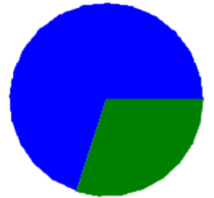
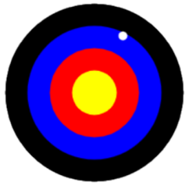
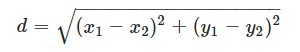
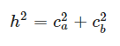
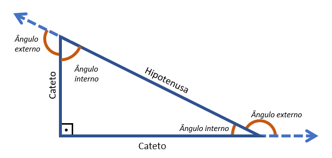
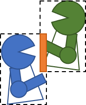
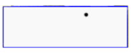

# 1. Física

Um dos problemas clássicos no ensino de Física é calcular quanto tempo levaria para que dois veículos que se deslocam em direções opostas se encontrem, dadas a distância entre eles e a velocidade de cada um.

Uma editora de livros digitais deseja incluir no seu catálogo de objetos de aprendizagem um elemento interativo em que os estudantes possam visualizar o deslocamento dos veículos e o ponto de encontro. A editora pede então que você desenvolva esse elemento.

Como protótipo, você deve ler do usuário três valores numéricos. O primeiro é a distância entre os veículos e os dois seguintes são a velocidade média de cada um. Seu programa deve apresentar o tempo que levará para os veículos se encontrarem e desenhar uma figura para ilustrar de forma proporcional os trajetos e o ponto de encontro, como exemplificado na figura abaixo.


Para calcular o tempo, utilize a equação abaixo, onde Vr é a velocidade relativa (como os veículos estão em sentidos contrários, Vr é a soma de suas velocidades), Dr é a distância relativa (distância entre os veículos) e Δt é o tempo decorrido.

Vr=Dr/Δt

### Exemplos de entrada e saída

```
Distância (km): 50
Velocidade 1 (km/h): 60
Velocidade 2 (km/h): 40
Tempo de encontro (h) = 0.5

Distância (km): 150
Velocidade 1 (km/h): 80
Velocidade 2 (km/h): 70
Tempo de encontro (h) = 1.0

Distância (km): 220
Velocidade 1 (km/h): 40
Velocidade 2 (km/h): 60
Tempo de encontro (h) = 2.2
```

# 2. Pizza

Seus professores de Pensamento Computacional gostariam de discutir os resultados das atividades apresentando proporcionalmente quantos alunos fizeram uma determinada atividade e quantos não fizeram. Para facilitar essa discussão, eles pediram para você desenvolver um programa para desenhar um gráfico de pizza, como o ilustrado abaixo, com a quantidade de alunos que fizeram e que não fizeram uma atividade.



Escreva um programa que lê dois valores inteiros do usuário e apresenta a proporção desses valores em %. Seu programa deve também desenhar um gráfico de pizza com as proporções.

### Exemplos de entrada e saída

```
Fizeram a atividade: 21
Não fizeram: 9
70.0% fez a atividade e 30.0% não fez.

Fizeram a atividade: 27
Não fizeram: 3
90.0% fez a atividade e 10.0% não fez.

Fizeram a atividade: 26
Não fizeram: 14
65.0% fez a atividade e 35.0% não fez.
```

# 3. Alvo

Seus amigos gostam muito de jogar dardo. Sempre que se encontram, passam horas jogando. O problema é que, vez por outra, a contagem se perde e ficam discutindo quem tem mais pontos. Você tem então a ideia de automatizar o processo capturando através de sensores a posição do dardo no alvo e calculando quantos pontos um dardo fez.

Para verificar se seus sensores estão bem ajustados, faça um programa que lê dos sensores (mas aqui será do usuário) os valores das coordenadas x e y de um dardo sobre o painel de alvo. Para conferir com a realidade, seu programa deve desenhar o painel de alvo e o ponto em que o dardo se encontra, como ilustrado na figura abaixo. Seu programa deve também apresentar quantos pontos o dardo fez, considerando 10 pontos para a faixa preta, 40 pontos para a azul, 70 para a vermelha e 100 para a amarela.



O cálculo da pontuação do dardo é realizado em função da distância do ponto ao centro do alvo, bem como a largura de cada faixa. A distância entre dois pontos (x1,y1) e (x2,y2) é calculada pela equação abaixo. Caso o centro do alvo seja a coordenada (0,0) a equação é simplificada para a raiz da soma dos quadrados das coordenadas do dardo.



Para o desenho e calculo da pontuação, considere que cada faixa tenha a largura de 25 pixels. Assim, a faixa amarela é definida por um círculo de raio 25, a vermelha de raio 50, a azul de 75 e a preta de 100.

**Obs**: Caso a função de desenho utilizada seja a dot(), há um ajuste de 5% a ser feito nas dimensões. Por exemplo, para desenhar um círculo de raio 100 é necessário inserir um ponto de tamanho 210 (diâmetro de 200 mais 5% = 210), portanto dot(210).

### Exemplos de entrada e saída

```
x: 30
y: 50
40 pontos

x: -70
y: -40
10 pontos

x: -20
y: 30
70 pontos

x: 10
y: -10
100 pontos
```

# 4. Ordem

Escreva um programa para colocar em ordem três valores inteiros quaisquer. Seu programa deve ler do usuário três valores e apresentá-los em ordem crescente. Mostre também visualmente os valores em ordem, desenhando linhas correspondendo ao valores dados.

**Obs**: Seu programa não deve utilizar repetições ou qualquer algoritmo de ordenação já existente em bibliotecas do Python.

### Exemplos de entrada e saída

```
Valor 1: 45
Valor 2: 12
Valor 3: 91
Em ordem: 12 45 91

Valor 1: 0
Valor 2: -10
Valor 3: 13
Em ordem: -10 0 13

Valor 1: 15
Valor 2: 14
Valor 3: 13
Em ordem: 13 14 15
```

# 5. Triângulo retângulo

A editora de livros interativos pediu novamente sua ajuda. Desta vez, ela quer que seus estudantes visualizem o triângulo retângulo cujas dimensões dos lados sejam informadas pelo usuário. Seu programa deve, portanto, ler do usuário as dimensões dos lados do triângulo, informar se elas formam ou não um triângulo retângulo e, se formam, desenhá-lo.

Para saber se as dimensões formam um triângulo retângulo, elas precisam atender a equação do Teorema de Pitágoras apresentada abaixo. Ou seja, o quadrado da hipotenusa (lado oposto ao ângulo reto, de 90º) é a soma do quadrado dos catetos (lados adjacentes ao ângulo reto).



Na entrada de dados, o usuário não precisa saber qual lado é a hipotenusa e quais são os catetos. Logo, o programa deve identificar qual o maior lado fornecido pelo usuário. Este será a hipotenusa e os demais os catetos. Para construir a figura será também necessário calcular os ângulos internos do triângulo e depois seus ângulos externos, pois estes serão o grau de rotação da caneta de desenho. A figura abaixo apresenta os elementos citados.



O cálculo do ângulo interno pode ser realizado pela lei dos senos, que diz que sen(α)=cα/h, onde cα é o cateto oposto a α e h é a hipotenusa. Assim, temos que o ângulo interno α pode ser calculado através da expressão alpha=arcsen(cα/h). Para calcular o ângulo externo, como o interno e externo são suplementares (a soma dos dois é 180º), basta subtrai-lo de 180.

Você precisará, portanto, da função asin() da biblioteca math, que calcula o arcoseno de um ângulo. Essa função retorna o valor em radianos e, por isso, antes de realizar as rotações da caneta, que recebe o ângulo em graus, será necessário transformar o valor de radiano em graus. Isso é feito pela função degrees(), também da biblioteca math.

### Exemplos de entrada e saída

```
lado 1: 4
lado 2: 5
lado 3: 3
Forma um triângulo retângulo

lado 1: 5
lado 2: 6
lado 3: 2
Não forma um triângulo retângulo

lado 1: 5
lado 2: 12
lado 3: 13
Forma um triângulo retângulo

lado 1: 5
lado 2: 9
lado 3: 8
Não forma um triângulo retângulo
```

# 6. Caixa envoltória

Muitos jogos digitais realizam testes de colisão entre elementos do jogos, tais como personagens, balas, muros, alvos, entre outros. Para simplicar os cálculos nos testes de colisão, vários jogos consideram a existência de uma caixa que envolve o personagem (daí o nome "caixa envoltória", do inglês bounding box). Se houver interseção entre as caixas de dois elementos do jogo, significa que um colidiu com o outro. A figura abaixo ilustra o caso de dois personagens, com suas respectivas caixas envoltórias, e a área de colisão em laranja. Mesmo que as imagens deles não se sobreponham, as caixas sim e, por isso, o jogo considera como uma colisão.



Já prevendo o desenvolvimento de um jogo, desenvolva um teste de colisão simples, envolvendo apenas uma caixa envoltória e um ponto. Escreva um programa que lê inicialmente do usuário quatro valores. Os dois primeiros são as coordenadas do canto superior esquerdo da caixa (X_esquerda,Y_topo) e os dois seguintes são a largura e altura da caixa, respectivamente. Em seguida, leia do usuário mais dois valores correspondentes às coordenadas do ponto (x,y) que você quer testar.

Se o ponto (x,y) estiver dentro da caixa, informe que o ponto colide com a caixa, caso contrário que não colide. Para verificar visualmente se seu teste está correto, desenhe uma caixa e o ponto fornecidos pelo usuário, como exemplificado na figura abaixo.



### Exemplos de entrada e saída

```
esquerda: 0
topo: 50
largura: 150
altura: 50
x: 100
y: 40
=> Colide!

esquerda: 40
topo: 40
largura: 50
altura: 50
x: 10
y: 10
=> Não colide!

esquerda: -20
topo: 10
largura: 80
altura: 20
x: 0
y: 0
=> Colide!

esquerda: -50
topo: -30
largura: 10
altura: 10
x: -10
y: 20
=> Não colide!
```
